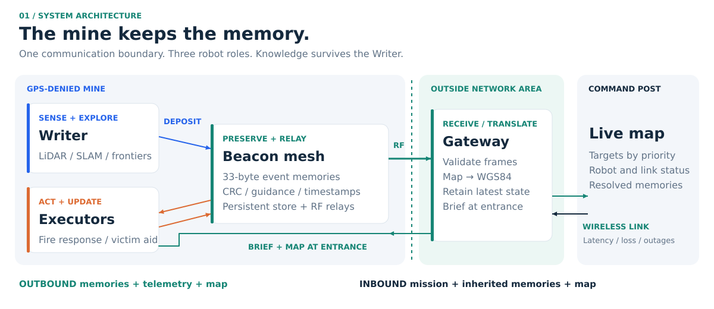
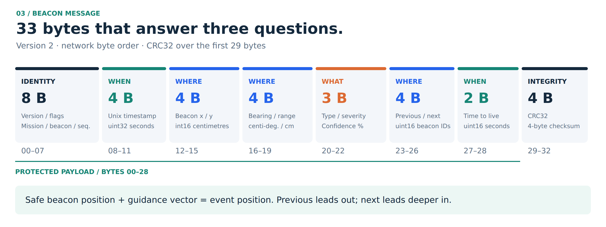
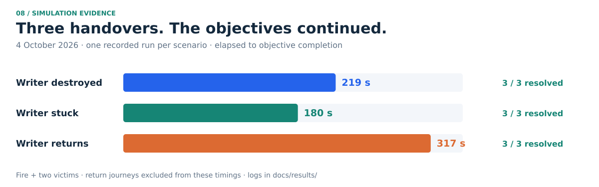
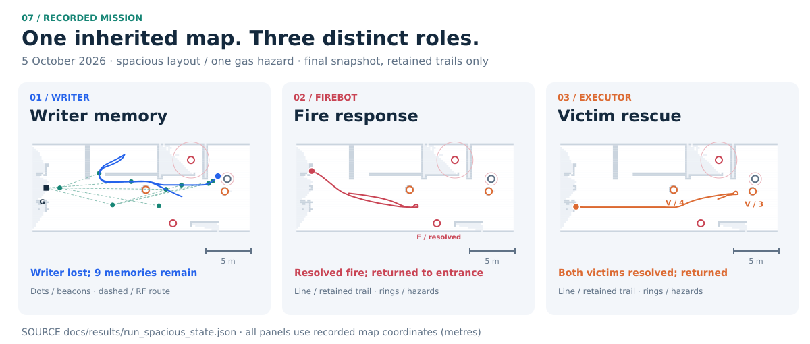

# LivingMap

**Spatial memory for emergency robots**


> If the Writer is lost, the map is not.

A Writer robot explores a mine without GPS, detects events and leaves radio beacons
that preserve **what happened, where to go and when the memory was written**.
Those beacons relay information to an Outside Network Area. A distant command post
then briefs Executor robots to continue the mission using the inherited memories.
The robots write their results back into the beacons.



## Review the submission

| [Installation and demo instructions](instructions.md) | Ubuntu setup, build, launch, mission controls and troubleshooting |
| [Documentation index](docs/README.md) | Requirement mapping and detailed technical documents |
| [Recorded evidence](docs/results/README.md) | Scenario logs, gateway snapshots and the limits of each recording |

## Why this design

- **Memory belongs to the environment.** Beacon records persist independently of the Writer.
- **A beacon describes an event from a safe standoff.** Its position marks a place already reached;
  its bearing and range locate the event.
- **The communication boundary is explicit.** Memories, telemetry and the Writer's map pass
  through the simulated RF mesh and gateway. Missions return through the gateway.
- **Decisions stay with the right component.** The command post chooses the robot and ordered
  targets. Each Executor plans its own route through inherited beacons and avoids known hazards.
- **Results become shared knowledge.** A confirmed `RESOLVED` advertisement tells later readers
  that a fire was extinguished or a victim assisted.

## What a beacon remembers

Each **33-byte beacon frame** preserves the event's identity, timestamp, position,
guidance and status, along with chain references, a time-to-live and a CRC integrity
check. This compact record lets another robot read and act on the memory.



[Vector diagram](docs/diagrams/beacon_frame.svg) · [Field definitions and encoding](docs/beacon_protocol.md)

## Mission continuity


The fire robot secures the scene first. The rescue Executor is then briefed with the
available memories and the Writer's last uploaded map. Victims are prioritized by
severity, confidence and freshness. Gas and blocked paths remain hazards to avoid.

## Evidence

The following are **individual recorded autonomous simulation runs**, using the
4 October 2026 layout. Each resolved one fire and two victim memories.



| Writer outcome | Fire resolved | Victims resolved | Elapsed to objectives complete | Evidence |
|---|---:|---:|---:|---|
| Destroyed; link outage also injected | 1 / 1 | 2 / 2 | 219 s | [Log](docs/results/run_destroyed.log) · [snapshot](docs/results/run_destroyed_state.json) |
| Stuck; radio remains active | 1 / 1 | 2 / 2 | 180 s | [Log](docs/results/run_stuck.log) |
| Returns home | 1 / 1 | 2 / 2 | 317 s | [Log](docs/results/run_return.log) · [snapshot](docs/results/run_return_state.json) |

These timings end at objective completion, **not at completed return journeys**,
and are not averages or reliability estimates. The later 5 October spacious-layout
[snapshot](docs/results/run_spacious_state.json) records all three resolved events
and both Executor robots back at the entrance:



The plots use recorded occupancy cells and retained trails, rather than the current
world geometry. The trails are bounded histories, not complete trajectories.
Recorded scenarios have one gas hazard; the current default has two and waits for
both before automatically ending the Writer's sortie. See the
[evidence notes](docs/results/README.md) for scenario boundaries.

**149 automated tests passed** on 5 October 2026. The central suite covers beacon
encoding, aging, placement, persistence, RF/mesh logic, GPS translation, mission
policies and integration guards. The headless information-flow demo also passes.
These checks complement recorded navigation; no package-local ROS tests are declared.

## Run it

Use Ubuntu 24.04, ROS 2 Jazzy and Gazebo Harmonic, with a working OpenGL desktop.
For the full three-robot simulation, the suggested resources are 8 CPU cores and
16 GB RAM. Follow [instructions.md](instructions.md) for installation details.

```bash
./scripts/bootstrap.sh     # install dependencies once
./scripts/build.sh
./scripts/test.sh
./scripts/run_demo.sh
```

Open **http://localhost:8081**, choose **Destroyed**, **Stuck** or **Returns**, and
click **Run full demo**. Follow the Writer's exploration, preserved beacon memories,
fire response and victim assistance. Check each Executor's detail for **back at the
entrance** after objective completion.

The separate **http://localhost:8081/harness** page controls event placement and
fault injection. `LIVING_MAP_RVIZ=false ./scripts/run_demo.sh` omits RViz on a busy
machine. Without ROS, `python3 tools/headless_demo.py` exercises the information
path; it does not validate physical navigation.

## Where each challenge requirement is answered

| Challenge requirement | Implementation | Documentation |
|---|---|---|
| Writer autonomy in a GPS-denied environment | LiDAR, SLAM Toolbox, frontier exploration, Nav2, stuck detection and battery-aware return | [Architecture](docs/architecture.md) |
| Beacon placement and drop mechanism | Event standoffs, entrance, junction, relay and spacing policies; physical dispenser planned | [Beacon design](docs/beacon_protocol.md#2-deciding-what-to-record-and-where) |
| Compact messages, RF broadcast and aging | 33-byte CRC-protected frame, wall-aware mesh and per-event TTL | [Protocol](docs/beacon_protocol.md) |
| Robot coordinates → real-world GPS | Map → gateway-relative ENU → WGS84, with compass bearings | [Coordinate frames](docs/coordinate_frames.md) |
| Outside Network Area; no direct robot–command-post link | Gateway reception, translation, link forwarding and entrance briefing | [Data flow](docs/data_flow.md) |
| Executor briefing and inherited navigation | Transactional memory/map seed, beacon graph, hazard keep-out and write-back | [Architecture](docs/architecture.md#how-the-executors-move-and-act) |
| Live map at the command post | Occupancy map, memories, routes, robot telemetry and mission status | [Screenshots](docs/screenshots/README.md) |
| Failure cases | Detection, response, evidence and residual limitations | [Failure analysis](docs/failure_analysis.md) |
| Physical implementation plan | Hardware, budget estimate, milestones and acceptance criteria | [Implementation plan](docs/implementation_plan.md) |

## Scope and limits

Phase 1 is a simulation. Event sensing uses configured zones; assistance and
extinguishing are timed actions. Navigation uses ideal odometry. RF, long-distance
communication and batteries use explicit models, not measured hardware performance.
There is one gateway. Gas neutralization and sensor-based contradiction of old
memories are not implemented.

`MISSION_COMPLETE` currently means the robot finished processing its targets: it
can include skipped targets or an unconfirmed beacon update, and precedes the end
of its return journey. Assess success from the individual target results,
`RESOLVED` memories and return details together. See
[failure analysis](docs/failure_analysis.md#interpreting-completion) for this distinction.

The final phase requires at least two physical robots and a functional radio/gateway
prototype. The [implementation plan](docs/implementation_plan.md) describes that work.

## Repository map

| Path | Purpose |
|---|---|
| `src/living_map_writer`, `src/living_map_events` | Exploration supervisor, sensors and Writer autonomy |
| `src/living_map_beacons`, `src/living_map_radio` | Persistent beacon protocol, placement, aging and RF mesh |
| `src/living_map_gateway`, `src/living_map_link_sim` | Outside Network Area and long-distance link model |
| `src/living_map_executor` | Mission inheritance, beacon routes, hazard policy, actions and write-back |
| `src/living_map_command_post`, `src/living_map_dashboard` | Dispatch, simulation harness and browser interface |
| `src/living_map_sim`, `src/living_map_bringup` | Robot models, mine world, launch and startup guards |
| `config/`, `tests/`, `scripts/` | Parameters, central test suite and setup/run commands |
| `docs/` | Technical documents, vector figures, report, presentation and recorded evidence |
