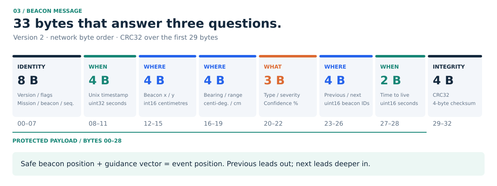
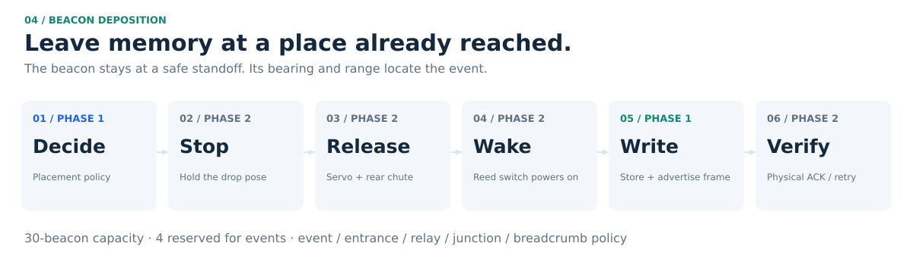
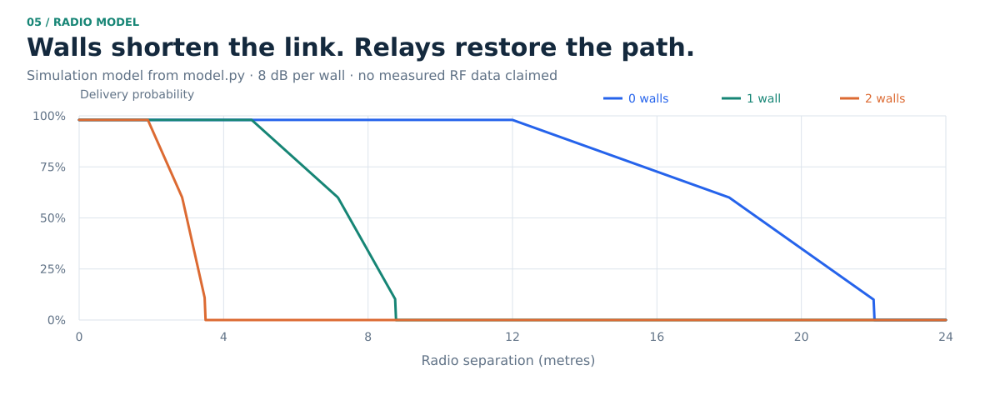

# Beacon message & signal design

## 1. The message: 33 bytes answering what, where and when

| Field | Type | Scaling | Bytes | Answers |
|---|---:|---|---:|---|
| version, role flags | uint8 ×2 | version = 2; roles below | 2 | |
| mission, beacon ID, sequence | uint16 ×3 | raw | 6 | |
| timestamp | uint32 | Unix seconds | 4 | WHEN |
| x, y | int16 ×2 | centimetres, Writer `map` frame | 4 | WHERE: the beacon |
| bearing | int16 | centi-degrees, counter-clockwise from map +X | 2 | WHERE: go this way |
| range | uint16 | centimetres (up to 655 m) | 2 | WHERE: this far |
| type, severity, confidence | uint8 ×3 | 0 NAV, 1 VICTIM, 2 GAS, 3 BLOCKED PATH, 4 FIRE; confidence in % | 3 | WHAT |
| previous, next | uint16 ×2 | beacon IDs: the way out and the way in | 4 | WHERE: the chain |
| TTL | uint16 | seconds | 2 | WHEN: expiry |
| CRC32 | uint32 | IEEE CRC32 over the first 29 bytes | 4 | integrity |

Network byte order (`!BBHHHIhhhHBBBHHHI`). Relays forward frames unmodified, so the
originator's CRC protects the content end to end, over any number of hops.

**The guidance vector.** A beacon always sits where the Writer stood, a place a robot has
reached.

- **Event beacons** (`STANDOFF` role) point at the event: *"FIRE · 2.5 m WSW"*. The hazard is
  described from a standoff instead of placing the beacon on the hazard. Recorded values from run 1: victim 2.0 m ENE, gas
  3.0 m N, fire 2.5 m WSW.
- **Chain beacons** point at the next beacon deeper in the mine. When a new beacon is dropped,
  its predecessor hears it and records `next`, bearing and range under a new sequence number.

Following `previous` leads to the entrance; following `next` leads deeper in.

**Why the beacon is not dropped on the event.** The challenge describes depositing a beacon
where each event is. We deliberately drop it at a safe standoff instead, and let the guidance
vector carry the event's exact position. A beacon thrown into a fire is destroyed, and one
inside a gas cloud would lead the next robot into the hazard. A standoff beacon survives, marks
a spot a robot has already reached safely, and still gives the event's position
(beacon + bearing × range, encoded at centimetre resolution), which is what the gateway converts
to GPS.

| Flag | Bit | Meaning |
|---|---:|---|
| JUNCTION | `0x01` | place type: the passage branches (3+ ways on) |
| RELAY | `0x02` | dropped to keep the radio chain to the gateway alive |
| STANDOFF | `0x04` | event beacon at a safe spot; the guidance vector points at the event |
| ENTRANCE | `0x08` | first beacon: the way out |
| BREADCRUMB | `0x10` | spacing fallback |
| RESOLVED | `0x20` | an Executor dealt with the event (fire out, victim assisted) |
| CORRIDOR | `0x40` | place type: a passage with two ways on |
| DEAD END | `0x80` | place type: a single way on |

**Place type.** Every beacon records the kind of place it sits in (junction, corridor, dead
end, or open area when none is set), measured from the Writer's SLAM map when it is dropped.
"Turn right / left / straight on" is *not* stored, because it depends on which way the reader
arrives. Whoever reads the beacon derives it by comparing its own direction of arrival with the
guidance bearing. The dashboard shows it the same way: *"turn right · 4.4 m E to B004 ·
corridor"*.

## 2. Deciding what to record and where

The Writer carries **30 beacons** and keeps **4 in reserve for events**. Each drop must earn
its place.

| Priority | Drop a beacon when… | Role |
|---:|---|---|
| always | an event is sensed (reuses a navigation beacon within 1 m if there is one) | STANDOFF |
| 1 | it is the first beacon past the entrance | ENTRANCE |
| 2 | the Writer's measured link into the mesh falls below 85 % (it drops one *before* losing contact) | RELAY |
| 3 | its own SLAM map shows 3 or more openings around it, with no beacon within 2.5 m | JUNCTION |
| 4 | no beacon is within 6 m | BREADCRUMB |

Junctions are found by sampling a 1.6 m ring in the occupancy grid: runs of free or unknown
cells at least 0.7 m wide, separated by walls, are openings. A corridor has 2, a T-junction 3,
open ground 0. Navigation beacons are only dropped inside the mine (past the entrance line).

## 3. How the Writer drops a beacon

**Drop sequence.** Every drop follows the same six steps; the colours in the figure show which
steps belong to the Phase 1 simulation and which the Phase 2 hardware adds.

| Step | What happens | Phase 1 (simulation) | Phase 2 (hardware) |
|---|---|---|---|
| 1 Decide | The placement policy (section 2) chooses to drop here: event standoff, entrance, relay, junction or spacing. For an event, a navigation beacon already within 1 m is rewritten instead, saving a beacon. | `placement.py`, beacon node | same code |
| 2 Stop | The Writer halts for about 1 s where it stands, so the beacon lands where the Writer has physically been. | not needed | motor controller |
| 3 Release | A servo gate under the magazine pushes exactly one beacon puck into a short rear chute. It lands **behind the rear wheels**, to reduce the risk of the Writer driving over it. | not needed | servo + chute |
| 4 Wake | Each puck sits on a magnet in the magazine; a reed switch keeps it off. Leaving the magazine powers it on, so stored beacons use no battery. | beacon created on drop | reed switch |
| 5 Write | The Writer radios the 33-byte memory to the new beacon: position, guidance vector, event, chain link and time. The beacon saves it and advertises it; hearing that advertisement confirms the drop. The previous beacon learns this one as its `next`. | beacon store + radio model | same frame over the real radio |
| 6 Verify | No advertisement within 3 s: the slot is marked dead and the next puck is dropped. A jammed gate (servo end-stop not reached) is reported, and the Writer keeps exploring. | — | firmware |

**What the simulation does today.** When the policy decides to drop, the beacon node creates a
beacon at the Writer's exact position in the SLAM `map` frame, writes its 33-byte frame with
CRC32, saves it in the persistent store (independent of the Writer, so it survives the Writer),
links it to the previous beacon and advertises it at once, then every 3 s. It appears in RViz and
on the command post map. The dispenser count is real: 30 beacons, 4 kept for events, and a drop is
refused when the dispenser is empty. The physical release (steps 2 to 4) is the Phase 2 work; the
[implementation plan](implementation_plan.md) schedules the dispenser prototype in week 4 with a
"20 drops without a jam" acceptance test, and a fallback if it jams.

## 4. The living map: robots write back

When an Executor finishes its task (a fire extinguished, a victim reached and assisted), it
updates that beacon so every later reader knows. The protocol is deliberately narrow:

1. The robot radios a write request: its copy of the memory with `RESOLVED` set and the next
   sequence number. Only a beacon within direct radio range receives it.
2. The beacon checks the request names **the same memory** (mission, beacon ID, event type and
   position at wire precision). It then marks **its own** copy resolved, so a robot can never move,
   re-type or truncate a memory, and links learned after the robot read it are kept.
3. The beacon saves the new version and advertises it at once. Hearing that advertisement is the
   robot's acknowledgement; until then it resends every second (20 s timeout).

A resolved fire is no longer a hazard, so robots stop keeping it out of their plans. The command
post never sends a robot to an event that is already resolved.

## 5. The radio signal: walls matter, beacons relay

- **Link model.** Delivery probability is 98 % up to 12 m, falls to 60 % at 18 m and 10 % at
  22 m, then zero. Each rock wall between two radios adds **8 dB**, applied as an equivalent
  longer free-space distance: one wall cuts the range about 2.5×, two walls about 6×. Walls
  come from the simulated world's geometry, as real rock would.
- **Flooding.** Every beacon advertises every 3 s. A beacon that hears a frame for the first
  time in a round re-transmits it once, so a memory reaches the gateway by any available path.
  In the real runs, memories from behind rock walls arrived in 2–3 hops.
- **Routing.** Robot telemetry follows the most reliable route (maximum end-to-end delivery,
  links ≥ 30 %) with 3 retries per hop.
- **Self-healing.** When a beacon is destroyed, routes re-form around it. In a real run, destroying
  relay B002 re-routed all 5 beacons that depended on it (through B003 and B005); the command post
  showed the new routes about 4 s later, including the satellite link's latency
  ([log](results/beacon_destroyed.log)).

## 6. Message aging

Information goes stale at different speeds. Each type has its own policy, and the frame's TTL
caps it.

| Type | FRESH until | AGING until | then STALE until expiry at |
|---|---:|---:|---:|
| Navigation | 5 min | 15 min | 30 min |
| Victim | 5 min | 15 min | 60 min |
| Gas | 2 min | 10 min | 30 min |
| Fire (spreads fastest) | 1 min | 5 min | 15 min |
| Blocked path | 15 min | 60 min | 18.2 h |

The Executor trusts fresh memories more (ageing +15 %, stale +40 % route cost), ignores expired
ones, and **still avoids stale hazards**: a stale fire is still a fire. The dashboard shows each
memory's lifetime bar and freshness.

**Planned for Phase 2: SUSPECT, when live sensing contradicts a memory.** Age is not the only
reason to distrust a memory. When a robot reaches a memory and its own sensors disagree (its
LiDAR sees open floor where a blocked path was recorded, or the fire robot finds no flame), the
memory should become SUSPECT: flagged on the command post and dropped from planning. The flags
byte is already full, so the design reuses the existing write-back path: the robot sends the
memory with confidence 0 under a new sequence number, the beacon applies it with the same
identity checks as `RESOLVED`, and every reader treats confidence 0 as SUSPECT. This is **not
implemented in Phase 1**: today a robot only uses age and ignores expired memories.

## Implementation

`living_map_beacons/protocol.py` (frame, `target_position`, `guidance`, `place_flags`,
`resolve_update`, `apply_resolve`),
`placement.py` (drop policy, junction detection), `store.py` (crash-tolerant persistence),
`aging.py`; `living_map_radio/model.py` and `mesh.py`. Tests: `tests/test_protocol.py`,
`test_placement.py`, `test_mesh.py`, `test_aging.py`.
