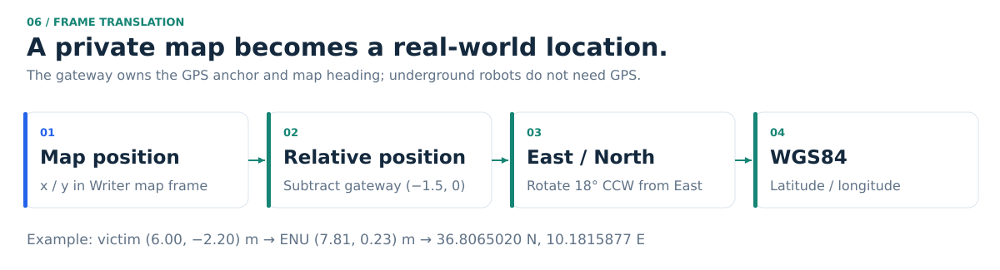

# Frame translation: robot coordinates → GPS

Underground there is no GPS. Every robot measures positions in its own private frame. The
Outside Network Area is the one place where a GPS reference exists, so it is where private
coordinates become real-world latitude and longitude.



## The frames

| Frame | Who uses it | Origin |
|---|---|---|
| `writer/odom`, `executor/odom` | each robot, privately | where that robot started |
| **`map`** (shared) | SLAM, beacons, radio, Executor planning | the Writer's start point at the mine entrance |
| gateway ENU | Outside Network Area | the gateway antenna; axes East / North / Up |
| WGS84 | command post, rescuers | latitude / longitude |

All beacon positions are written in the Writer's SLAM `map` frame. Each Executor is tied
into the same frame by its known parking spot at the entrance: the Executor (rescue) at map (−2, −2)
and the fire robot at map (−2, 2), 2 m either side of the Writer's start.

## The conversion (done at the gateway)

```
map (x, y)  →  subtract gateway position (−1.5, 0)
            →  rotate by the anchor heading (18°, map +X measured counter-clockwise from East)
            →  local East / North in metres
            →  WGS84 latitude / longitude (local tangent plane)
```

The anchor (gateway latitude, longitude and heading) lives in `config/gps_anchor.yaml`. It is
measured once, outside, where GPS works. The conversion uses a local tangent-plane approximation for the tens of metres of
the mine. Its numeric precision does not establish real GPS accuracy: anchor
measurement, map drift and heading error determine field accuracy.

Bearings are translated too: a map bearing *b* becomes compass bearing `90° − (18° + b)`,
so the command post can say *"victim 1.9 m ENE of beacon B002"*.

## Equations and heading convention

For gateway map position `(gx, gy)` and map-axis heading `θ` measured
counter-clockwise from geographic East:

```text
dx = x − gx                 dy = y − gy
East  = dx cos θ − dy sin θ
North = dx sin θ + dy cos θ
latitude  = latitude₀ + degrees(North / R)
longitude = longitude₀ + degrees(East / (R cos latitude₀))
R = 6,378,137 m
compass bearing = (90° − (θ + map bearing)) mod 360°
```

Angles in the trigonometric terms use radians. A compass heading supplied by a
field instrument must first be converted to ENU yaw: `θ = 90° − compass heading`.
The gateway translates the event position reconstructed from the beacon and its
guidance, as well as the beacon position itself.

## Worked example (real run, victim beacon B002)

From the recorded snapshot `docs/results/run_destroyed_state.json`:

| Step | Value |
|---|---|
| Beacon B002 position (map) | (4.06, −2.40) m |
| Guidance in the frame | bearing 5.9°, range 1.95 m |
| Victim position (map) = beacon + range × (cos, sin)(bearing) | (6.00, −2.20) m |
| Relative to gateway | (7.50, −2.20) m |
| Rotated by 18° → East, North | (7.81, 0.23) m |
| **Victim GPS** | **36.8065020 N, 10.1815877 E** |
| Guidance as a compass bearing | 66.1° (ENE) |

The same pipeline runs for every memory: the dashboard shows the GPS of the event itself
(and of its beacon, when they differ).

## Checks

Unit tests cover the origin, pure East and North displacements, the heading rotation, the
compass conversion, and that the event, gateway and robot positions in the Gazebo world match
the configured `map` coordinates (`tests/test_gps.py`, `test_coordinate_contract.py`,
`test_gateway_helpers.py`).

## Simulation note

Gazebo reports each robot's true pose, which the bringup converts to that robot's odometry
frame. This is ideal odometry. On the physical robots, wheel encoders + IMU + LiDAR SLAM take
its place (see the [implementation plan](implementation_plan.md)).
