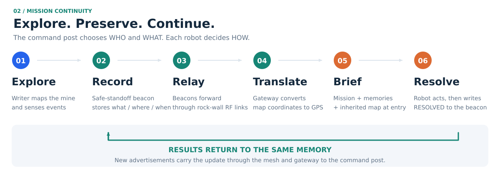
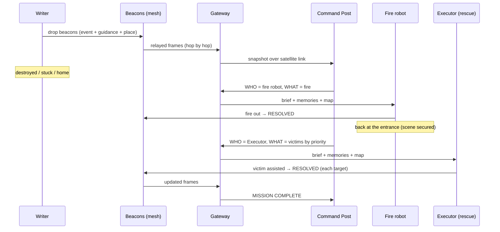

# Data flow

Four flows cross the system. All of them pass through the Outside Network Area (gateway), which
plays four roles along the way:

| Role | What the gateway does | Flow |
|---|---|---|
| **RECEIVE** | Takes in what the Writer produced: beacon frames relayed by the mesh (CRC, duplicates and sequence checked), robot telemetry and the Writer's SLAM map, its private frame | 1, 2, 4 |
| **TRANSLATE** | Converts map positions and bearings into GPS and compass bearings ([frame translation](coordinate_frames.md)) | 1 |
| **CARRY** | Sends the latest state to the distant command post over the satellite / wireless link and keeps it through outages | 1, 2, 4 |
| **BRIEF** | Validates each mission and delivers one brief per Executor, with every memory and the map, before it enters | 3 |

## 1. Knowledge out: Writer → world

| Step | What happens | Where |
|---|---|---|
| 1 | The Writer senses an event (victim, gas, fire, blocked path) within sensor range. | event sensor |
| 2 | It drops a beacon **where it stands**, a safe standoff, recording the event's bearing and distance and the kind of place (corridor, junction, dead end). A navigation beacon already within 1 m is rewritten instead of spending a new one. | beacon dispenser |
| 3 | The memory is encoded into a 33-byte frame with CRC32 and saved to the persistent store. The previous beacon learns this one as its "next". | beacon store |
| 4 | Every beacon advertises every 3 s. Neighbours relay the frame unmodified, hop by hop, until it reaches the gateway. | radio mesh |
| 5 | The gateway checks the CRC, drops duplicates and older sequences, and converts the beacon and the event to GPS. | gateway |
| 6 | The latest state goes over the satellite link (latency, loss, bandwidth cap). During an outage only the newest snapshot is kept and sent on recovery. | link |
| 7 | The command post shows the memory on the live, read-only map. | dashboard |

## 2. Telemetry: robots → world

Status (state, position, battery) of every robot and the Writer's SLAM map go to the robot's
own radio, not to the gateway directly. The mesh routes each message along the most reliable
path, with three link-layer retries per hop. Without a route, nothing arrives and the dashboard
marks the robot **radio silent** after 4 s. The Writer's map is sent every 2 s while it is alive
and reachable. The gateway keeps the full-resolution copy for briefings and sends a compressed
copy outside, only when it changes.

## 3. Missions in: world → Executors

| Step | What happens |
|---|---|
| 1 | When the Writer is destroyed, stuck or back home, the command post decides **who** goes for each kind of event: fires → fire robot, victims → Executor (gas has no capable robot and is only avoided). It also decides **what**, as an ordered list of live, unresolved targets: severity, then confidence, then freshness. |
| 2 | Each brief crosses the satellite link with a unique ID; retries reuse the ID and the gateway deduplicates them. The fire robot is briefed first. The Executor is briefed once the fire is out and the fire robot is back at the entrance: secure the scene, then rescue. |
| 3 | The gateway checks every target exists, is an event of one kind and has not expired, and that the robot is ready and **at the entrance** (one radio hop from the gateway). |
| 4 | The gateway sends the brief to that robot's own channel, with every beacon frame it holds and the Writer's last map in a single message. A robot does not plan until it has the batch matching its brief. |
| 5 | Each robot follows the beacon graph to its targets (see [architecture](architecture.md#how-the-executors-move-and-act)), drives with Nav2 and confirms the beacons it hears. |

## 4. Results back: Executors → beacons → world

| Step | What happens |
|---|---|
| 1 | On arrival the robot acts: the fire robot extinguishes the fire (5 s), the Executor assists the victim (3 s). |
| 2 | It radios a write request to that event's beacon: "mark this memory resolved". |
| 3 | The beacon checks the request names the same memory, marks its own copy `RESOLVED`, saves it and advertises it at once. |
| 4 | The robot hears the new version (its acknowledgement), moves to its next target or reports MISSION COMPLETE, then drives back to the entrance and stops. |
| 5 | The update floods through the mesh to the gateway: the command post shows the fire out and the victim assisted, and other robots stop treating the extinguished fire as a hazard. |

