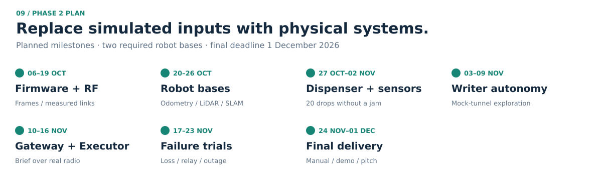

# Implementation plan: from simulation to physical prototype

Phase 1 demonstrates the architecture in recorded simulation scenarios. Phase 2 (final deadline **1 December 2026**)
builds it physically. The software was designed so that most of it carries over unchanged:
hardware replaces the *simulated inputs*, not the logic.

## What carries over and what is replaced

| Phase 1 (simulation) | Phase 2 (physical) | Software change |
|---|---|---|
| Simulated event zones | Camera person detection (victim), gas sensor, flame sensor | New driver publishes the same `DetectedEvent` message |
| Gazebo LiDAR + ideal odometry | 2D LiDAR, wheel encoders + IMU, SLAM Toolbox | Same ROS topics |
| Beacon store + radio model | Battery beacons: microcontroller + long-range radio | `protocol.py` frame becomes the firmware frame (same 33 bytes, same CRC) |
| Radio mesh simulator | Firmware flooding: re-transmit each new (beacon, sequence) once | Same rules as `mesh.py` |
| `DeployBeacon` service | Servo-driven dispenser on the Writer | Same placement policy (`placement.py`) |
| Satellite link model | Cellular / Wi-Fi uplink (a satellite modem in a real deployment) | Gateway and command post unchanged |
| Battery model | Measured pack voltage / fuel gauge | Same turn-back rule: charge to get home × 1.5 + 10 % |
| Simulated extinguishing | Extinguisher valve or water-mist pump on the fire robot | Same action phase and beacon write-back |
| Trust by age only | Trust by age **and** live sensing: a memory the robot's own sensors contradict becomes SUSPECT | New check on arrival; sent through the existing write-back path as confidence 0 ([design](beacon_protocol.md#6-message-aging)) |

## Hardware

The challenge requires at least two physical robots (Writer and Executor). The fire robot is a
second Executor built on the same platform; if time or budget is short, the Writer and the rescue
robot are built first and the fire robot follows.

| Subsystem | Components |
|---|---|
| Writer robot | Skid-steer base; Raspberry Pi 5 (ROS 2); ESP32 motor controller; 2D LiDAR; wheel encoders; IMU; camera; gas sensor; IR flame sensor; beacon dispenser (servo + magazine) |
| Executor (rescue robot) | Same base and navigation stack; no event sensors or dispenser |
| Fire robot | Same base and navigation stack + small extinguisher (or water-mist pump) and a thermal sensor to confirm the fire is out |
| Beacons (×10 for trials) | Low-power microcontroller; long-range sub-GHz (LoRa-class) radio; small LiPo cell; status LED; 3D-printed shell sized for the dispenser |
| Outside Network Area | Raspberry Pi; the same radio as the beacons; GPS receiver for the anchor; cellular / Wi-Fi uplink |
| Command post | Any laptop with a browser (existing dashboard) |

The radio frequency band and transmit power will be chosen only after confirming the
applicable Tunisian regulations. Module availability and the permitted band must be confirmed before procurement.

## Budget

Planning estimates in Tunisian dinars, October 2026; supplier quotations and
availability have not been validated. The two-robot budget excludes the optional
fire robot.

| Part of the system | Main components | Cost (DT) |
|---|---|---:|
| Writer robot | base, Raspberry Pi 5, 360° LiDAR, sensors, dispenser, battery | 1,450 |
| Executor (rescue robot) | same base, Raspberry Pi 5, 360° LiDAR, battery | 1,290 |
| 10 beacons | ESP32 + LoRa radio, battery, printed shell | 830 |
| Outside Network Area | LoRa radio, GPS receiver (team laptops as computers) | 170 |
| Shared | charger, 3D-printing filament, wiring, mock tunnel, spares | 490 |
| **Total** | | **≈ 4,230** (≈ 4,650 with a 10 % margin) |
| Fire robot (optional) | Executor platform + pump and temperature sensor | + 1,375 |

The two LiDARs are the largest cost; borrowing them from the university lab would lower the total.

## Schedule

| Weeks | Dates | Milestone | Done when |
|---|---|---|---|
| 1–2 | 6–19 Oct | Parts ordered; beacon firmware encodes and decodes the 33-byte frame | Frames from a beacon decode on the gateway with valid CRC |
| 2 | 13–19 Oct | Radio range tests in open corridors and through walls | Measured delivery-vs-distance curve replaces the model's parameters |
| 3 | 20–26 Oct | Robot bases: motors, odometry, LiDAR, ROS 2, SLAM | Both robots map a corridor |
| 4 | 27 Oct–2 Nov | Dispenser prototype; victim, gas and flame detection | 20 drops without a jam; each sensor triggers an event |
| 5 | 3–9 Nov | Writer autonomy in a mock tunnel; beacon deposition policy on hardware | Writer explores and drops entrance, junction and event beacons |
| 6 | 10–16 Nov | Gateway, mesh and command post with real radios; Executor briefing; SUSPECT check on arrival | A deep beacon reaches the gateway through a relay; a cleared blockage is flagged SUSPECT |
| 7 | 17–23 Nov | End-to-end missions and failure cases (Writer destroyed / stuck, beacon removed, link cut); fire robot if built | All three Writer outcomes end in MISSION COMPLETE |
| 8 | 24 Nov–1 Dec | User manual, demo video, pitch rehearsal, code freeze | Submission |

## Main risks

| Risk | Mitigation |
|---|---|
| Radio range underground is shorter than modelled | Week-2 measurements set the relay threshold; the placement policy already drops relays before the link fails |
| Dispenser jams | Simple gravity magazine + servo gate; fallback: the Writer marks the drop point and an operator places the beacon in trials |
| Victim detection false positives | Confidence is stored in every frame; the command post picks targets by severity, then confidence |
| SLAM drift in feature-poor tunnels | Add IMU fusion; beacons give the Executor fixed, physically reached waypoints |
| Battery life of beacons | Low duty cycle (one advertisement every few seconds); sleep between transmissions |
