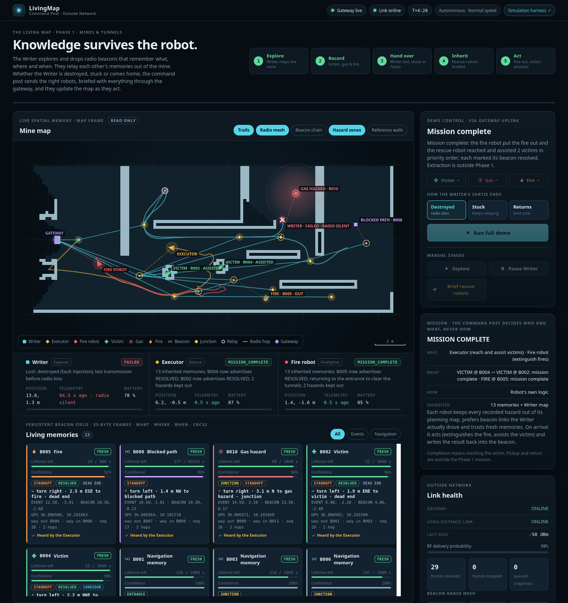
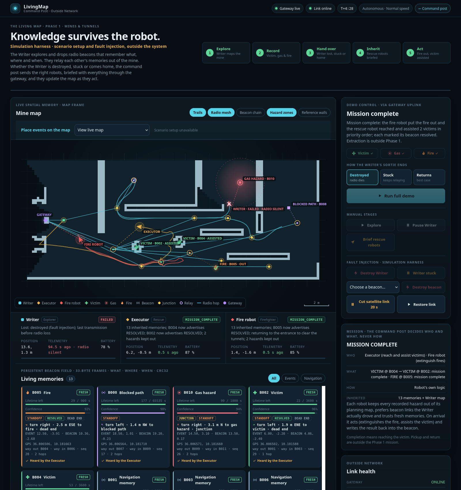

# Command post screenshots

Both images are the real dashboard (`src/living_map_dashboard`) displaying the gateway snapshot
recorded at the end of a real Gazebo run on 4 October 2026 (`docs/results/run_destroyed_state.json`):
the Writer destroyed, the fire robot put the fire out, the Executor assisted both victims in
priority order, and every handled event was marked resolved.

| Image | View |
|---|---|
|  | **Command post** (`http://localhost:8081`): read-only live map, the three robots with telemetry and battery, the mission (who, what, how) and the living memories, each with its guidance ("turn right · 2.5 m ESE to fire · dead end"), roles and freshness. |
|  | **Simulation harness** (`http://localhost:8081/harness`): the same live view plus everything outside the system itself: event placement for the next run, fault injection (destroy or immobilise the Writer, destroy a beacon, cut the satellite link) and restart settings. |

What the map shows: the Writer's SLAM map, beacons by role (◆ junction, ■ entrance), dashed
guidance from each event beacon to its event, resolved events ticked ("OUT", "ASSISTED"), keep-out
zones of unresolved hazards, radio routes to the gateway (teal lines) and every robot's trail.
